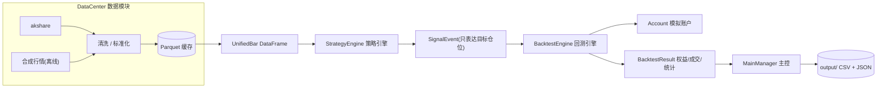

# QuantitativeTrading —— 量化交易模型核心骨架

一个模块化、事件驱动、面向 Docker 微服务部署的量化交易模型骨架。包含数据获取（akshare）、
双均线示例策略、轻量级回测引擎与完整的工作流编排，开箱即跑。

## 1. 架构设计

系统划分为四个高度解耦的核心模块，模块之间只通过**统一数据契约**和**事件对象**通信：



### 模块职责

| 模块 | 职责 | 关键约束 |
| --- | --- | --- |
| `DataCenter` | 通过 akshare 获取历史/实时行情，清洗为标准 `UnifiedBar`，本地 Parquet 缓存，网络失败自动降级合成数据 | 输出格式全系统唯一契约，数据源可插拔 |
| `StrategyEngine` | 策略基类 + 双均线示例策略；行情 → 因子 → 目标仓位（1/0/-1）与 `SignalEvent` | 禁止触碰资金与下单；指标库（pandas-ta / ta-lib）可替换 |
| `BacktestEngine` | 模拟账户（现金、持仓、佣金、滑点）、模拟撮合、胜率/回撤/夏普等绩效统计 | 收盘出信号、次日开盘成交，规避未来函数 |
| `MainManager` | 环境初始化、串联工作流、结果落盘与摘要展示、CLI 入口 | 单一编排入口，可整体替换为微服务 API |

### 事件流

```
BarEvent → SignalEvent → OrderEvent → FillEvent → Account 记账
（DataCenter）  （策略）      （引擎）      （撮合）     （账户）
```

事件对象全部支持 `to_dict()` 序列化，后续微服务化可直接映射为消息队列 payload。

## 2. 目录结构

```
QuantitativeTrading/
├── qtcore/                      # 核心包
│   ├── config.py                # 全局配置(dataclass + pathlib)
│   ├── dotenv.py                # 极简 .env 加载器(零第三方依赖)
│   ├── events.py                # 事件驱动核心(Bar/Signal/Order/Fill)
│   ├── main_manager.py          # MainManager 主控 + CLI
│   ├── datacenter/
│   │   └── data_center.py       # DataCenter 数据模块
│   ├── screener.py              # StockScreener 选股模块(两级选股)
│   ├── strategy/
│   │   ├── base.py              # StrategyBase 策略基类
│   │   ├── ma_cross.py          # 双均线交叉示例策略
│   │   └── __init__.py          # 策略注册表 + 工厂
│   └── backtest/
│       ├── account.py           # 模拟账户
│       └── engine.py            # 回测引擎 + 绩效统计
├── config/                      # 业务配置
│   ├── email_config.json.example  # 邮箱配置模板(真实文件不入库)
│   ├── llm_config.json.example    # DeepSeek 配置模板(真实文件不入库)
│   └── trading_config.json        # 交易/策略参数
├── .env.example                 # 密钥环境变量模板(复制为 .env 后填写)
├── tests/test_smoke.py          # 离线冒烟测试
├── run_demo.py                  # 一键演示入口
├── run_daily.py                 # 每日自动交易入口(交易日交易 + 邮件日报)
├── screen_stocks.py             # 选股器命令行入口
├── train_model.py               # Walk-Forward 训练/调参
├── train_deepseek.py            # DeepSeek 驱动调参
├── fullmarket_validation.py     # 全市场无偏差验证
├── run_demo.bat / run_offline.bat / run_tests.bat  # Windows 一键脚本
├── environment.yml              # Conda 环境定义
├── requirements.txt             # pip 依赖
├── Dockerfile                   # 微服务容器镜像
└── docker-compose.yml           # 容器编排示例
```

## 3. 环境搭建

### 方式一：Conda（推荐）

```bash
# 1. 按项目定义创建环境(环境名固定为 QuantitativeTrading)
conda env create -f environment.yml

# 2. 激活环境
conda activate QuantitativeTrading

# 3. 验证
python -c "import pandas, numpy, akshare, pandas_ta; print('OK')"
```

### 方式二：现有 Conda 环境

```bash
conda create -n QuantitativeTrading python=3.12 -y
conda activate QuantitativeTrading
pip install -r requirements.txt
```

### 核心依赖清单

| 库 | 推荐版本 | 用途 |
| --- | --- | --- |
| pandas | >=2.0, <3 | 数据处理与标准化 |
| numpy | >=1.24, <3 | 数值计算 |
| akshare | >=1.12 | 国内市场数据获取 |
| pandas-ta | >=0.3.14b0 | 技术指标计算（纯 Python，部署零负担） |
| pyarrow | >=15 | Parquet 行情缓存引擎（可选，不装时缓存自动回退 CSV） |

> **ta-lib 备选**：若团队要求使用 ta-lib，将其加入依赖并替换 `qtcore/strategy/ma_cross.py`
> 中 `_sma()` 的实现为 `talib.SMA(close.values, timeperiod=window)` 即可，策略其余代码零改动。
> 注意 ta-lib 需要编译原生 C 库，Docker 部署时需额外安装编译工具。

### 密钥配置（邮箱授权码 / DeepSeek API Key）

系统从项目根目录的 `.env` 读取密钥（自动加载，无需额外设置），
未配置的项会自动回退到 `config/*.json`。**所有密钥文件均已被 `.gitignore` 排除，不会进入代码仓库。**

```bash
# 1. 复制模板
cp .env.example .env          # Linux / macOS
copy .env.example .env        # Windows

# 2. 编辑 .env, 填入真实值
#    EMAIL_AUTH_CODE=你的邮箱SMTP授权码(非登录密码)
#    DEEPSEEK_API_KEY=sk-你的DeepSeek密钥
```

`.env` 支持的变量：

| 变量 | 必填 | 说明 |
| --- | --- | --- |
| `EMAIL_AUTH_CODE` | 使用邮件功能时必填 | 邮箱 SMTP 授权码（163/QQ 等邮箱设置中获取） |
| `DEEPSEEK_API_KEY` | 使用 DeepSeek 调参时必填 | DeepSeek API Key |
| `EMAIL_SENDER` | 可选 | 发件邮箱，默认读 `config/email_config.json` |
| `EMAIL_SENDER_NAME` | 可选 | 发件人显示名 |
| `EMAIL_SMTP_HOST` | 可选 | SMTP 服务器，默认 `smtp.163.com` |
| `EMAIL_SMTP_PORT` | 可选 | SMTP 端口，默认 `465` |
| `EMAIL_RECIPIENTS` | 可选 | 收件人列表，逗号分隔 |

> **优先级**：环境变量 > `config/*.json`。即使不配置 `.env`，把密钥直接填进
> `config/email_config.json` / `config/llm_config.json` 也可以正常运行
> （结构参考同目录下的 `.example` 模板）。

## 4. 快速开始

首次运行前先按上文完成密钥配置（不涉及邮件 / DeepSeek 的功能可跳过）。

```bash
# 离线演示(不依赖网络, 自动生成合成行情)
python run_demo.py --offline

# 真实数据: 贵州茅台日线, 双均线 10/30, 200 万初始资金
python run_demo.py --symbol 600519 --start 20200101 --end 20251231 --fast 10 --slow 30 --capital 2000000

# 等价入口
python -m qtcore --offline

# 运行冒烟测试
python -m unittest discover -s tests -v
```

### Windows 一键运行

不需要手动激活环境，双击即可：

- `run_offline.bat` — 离线演示（合成行情，验证全流程）
- `run_demo.bat` — 真实数据回测（默认 000001 平安银行）
- `run_tests.bat` — 冒烟测试

脚本会自动激活 `QuantitativeTrading` 环境（Conda 安装在 `F:\tool\anaconda`）。
若你的 Anaconda 路径不同，修改脚本顶部的 `CONDA_BAT` 变量即可。

### 选股（全市场 / 指定股票池）

项目内置两级选股流水线（[screen_stocks.py](screen_stocks.py)）：

```bash
# 模式一: 全市场选股 —— 初筛(排除ST/价格/成交额) -> 按成交额取前 N 只 -> 双均线回测排序
python screen_stocks.py --limit 20 --start 20240101 --end 20251231

# 模式二: 指定股票池 —— 只在你给的几只里挑
python screen_stocks.py --symbols "000001 600519 300750" --top 5

# 离线演示(合成数据)
python screen_stocks.py --offline
```

结果写入 `output/screen_result.csv`（全部候选的收益/夏普/回撤/胜率排名）。
快照接口不可用时自动降级为全市场代码列表初筛；个股数据走 Parquet 缓存，
第二次选同一批股票会大幅提速。

### 每日自动交易（实盘/仿真日报）

```bash
# 发送一封测试邮件(验证邮箱配置是否可用)
python run_daily.py --test-email

# 运行今天完整流程(仅交易日才会交易并发送日报)
python run_daily.py --today

# 指定日期补跑 / 强制附带周报、月报
python run_daily.py --date 20260810
python run_daily.py --today --weekly --monthly
```

交易结果与持仓写入 `data/trading.db`，报告通过邮件发送。
生产环境建议配合 Docker + cron（见下文）每天收盘后自动执行。

回测完成后，`output/` 目录生成：

- `equity_curve.csv` — 每日权益、现金、持仓市值
- `trades.csv` — 逐笔成交明细（含佣金与已实现盈亏）
- `stats.json` — 绩效指标（总/年化收益、夏普、最大回撤、胜率、盈亏比）

> **行情缓存**：优先写入 Parquet；未安装 pyarrow 时自动回退 CSV，
> 缓存功能零额外依赖。第二次运行同一标的同时段将直接命中缓存。

## 5. 回测规则说明

- **信号延迟**：T 日收盘产生信号，T+1 日开盘价成交，规避未来函数；
- **成本**：佣金按成交金额比例收取，买入/卖出分别按滑点调整成交价；
- **仓位**：单次建仓金额 = 最近权益 × `position_ratio`，向下取整到整手（A 股 100 股/手）；
- **T+1**：当日买入最早下一交易日卖出，本骨架天然满足；
- **做空**：默认仅做多；`--long-short` 开启后支持多空双向（期货/两融场景）。

## 6. Docker 微服务化部署

```bash
# 构建并运行
docker compose up --build

# 或单独构建
docker build -t quant-trading .
docker run --rm -v ${PWD}/output:/app/output quant-trading
```

> **密钥安全**：`.env` 与 `config/email_config.json`、`config/llm_config.json`
> 已通过 `.dockerignore` 排除，不会被打进镜像；容器运行时通过
> `docker compose` 的 `env_file: .env` 注入密钥。

### 向微服务演进的路线

1. **服务拆分**：`DataCenter`、`StrategyEngine`、`BacktestEngine` 可各自独立成服务，
   通过消息队列（Kafka / RabbitMQ）传递 `BarEvent` / `SignalEvent`（事件已支持序列化）；
2. **选股接入**：`StockScreener` 已提供"全市场初筛 + 因子回测排序"流水线，
   可作为独立的选股服务，把 Top N 结果推送给回测/实盘服务；
2. **接口层**：在 `MainManager` 之上增加 REST 网关（如 FastAPI），
   暴露「提交回测任务 / 查询结果」接口，`BacktestResult.save()` 的 JSON 可直接作为响应；
3. **任务调度**：将 `MainManager.run()` 包装为定时任务/工作队列任务，支持多标的批量回测；
4. **状态管理**：配置类（`AppConfig`）已集中管理全部参数，可平滑迁移到配置中心；
5. **实盘桥接**：新增 `ExecutionGateway` 模块消费 `SignalEvent` 并连接券商接口，
   策略层无需任何改动。

## 7. 扩展指南

### 新增策略（三步）

1. 新建 `qtcore/strategy/your_strategy.py`，继承 `StrategyBase`；
2. 实现 `compute_indicators()` 与 `target_positions()`；
3. 在 `qtcore/strategy/__init__.py` 的 `STRATEGY_REGISTRY` 注册类名，
   即可通过 `--strategy your_strategy` 调用。

### 新增数据源

在 `DataCenter` 中仿照 `fetch_historical()` 新增一个获取方法，最后统一调用
`normalize()` 转成 `UnifiedBar` 即可，上层零感知。

## 8. 免责声明

本项目为量化交易系统**工程化骨架**，仅用于学习与研究。合成行情与示例策略不构成任何投资建议，
实盘使用前请自行验证数据准确性、交易成本与风控逻辑。

## 9. 常见问题

### `conda run` 打印中文输出报 UnicodeEncodeError

`conda run` 在 GBK 控制台捕获 stdout 时存在编码 bug。解决办法：

- 直接激活环境后运行：`conda activate QuantitativeTrading && python run_demo.py --offline`；
- 或使用 `conda run --no-capture-output -n QuantitativeTrading python run_demo.py --offline`。

### 为什么 `conda env list` 里有两个 QuantitativeTrading

`F:\tool\anaconda\envs\QuantitativeTrading` 是历史遗留的空环境（当前用户无写权限）；
本项目实际使用的是工作区内的 `F:\data\Python_data\QuantitativeTrading\.conda\envs\QuantitativeTrading`，
已注册到 Conda 的 `envs_dirs`，按名字激活时优先解析到它。

## 10. 训练与调参（大模型驱动）

内置训练器 [train_model.py](train_model.py)：用 **2020–2026 数据**切分为
训练集(2020–2022)/验证集(2023)/测试集(2024–2026)，把**选股(Top-K) + 交易(策略参数) + 时间窗口**
联合训练，走 Walk-Forward 流程：

```bash
# 1) 生成提案模板(由大模型/人工填写)
python train_model.py --write-template proposals.json

# 2) 执行一轮训练: 每个提案 = 一轮"选股+调参", 输出 训练/验证/测试 三套指标
python train_model.py --proposals proposals.json --pool-size 12 --top-k 5

# 3) 滚动 Walk-Forward(多折交叉验证, 推荐) + CSI300 代表性股票池
python train_model.py --proposals proposals.json --universe csi300 --rolling --folds 3 --pool-size 20

# 4) 指定股票池 / 离线演示 / 调整重试次数
python train_model.py --proposals proposals.json --symbols "000001 600519 300750"
python train_model.py --rounds 2 --offline
python train_model.py --proposals proposals.json --retries 2
```

调参循环: 大模型观察每轮日志(`output/training_log.csv`)中的验证/测试指标，
提出下一轮提案(修改 fast/slow、top_k、选股指标、仓位等)，系统评估后继续迭代——
即"大模型驱动训练"。框架的提案源可插拔，若设置 `OPENAI_API_KEY` 可扩展为全自动 API 循环。

滚动模式要点:
- 每个折独立"训练段选股 + 验证/测试段评估"，输出**平均验证/测试指标**与正收益折数，
  消除单一验证窗口的偶然性；
- 股票池来源 `--universe csi300`(沪深300成分股, csindex 官方/新浪双通道)或 `all`(全市场快照)；
- 行情拉取在 DataCenter 统一做指数退避重试(`--retries` 可调)，并报告每个窗口的**数据覆盖率**。
- 数据源**多通道自动回退**：东财 `stock_zh_a_hist` → 新浪 `stock_zh_a_daily` → 腾讯 `stock_zh_a_hist_tx`，
  单个数据源被网络拦截/限流时自动切换，保证真实数据可用。

已完成的示例调参记录见 [output/llm_training_report.md](output/llm_training_report.md)。

### 全市场扫描（可选，耗时较长）

```bash
# 全市场选股: 代码列表初筛(排除ST/退市/北交所) -> 并发拉取 -> 按夏普排名
python screen_stocks.py --universe all --no-snapshot --limit 5200 --workers 16 \
    --start 20240101 --end 20251231 --retries 2 --top 20

# 无偏差验证: 2024 选股 -> 2025 测试(选择窗口与测试窗口无重叠, 全走本地缓存)
python fullmarket_validation.py
```

注意: 选股窗口与测试窗口重叠会制造"看起来很好"的假样本外结果，
`fullmarket_validation.py` 用严格无重叠的窗口检验选股是否有真实区分度。

### DeepSeek 驱动调参（含市况切分与大盘对比）

```bash
# 完整流程: 市况切分(训练/测试都含牛熊横盘) -> DeepSeek 6 轮提案 ->
# 训练集选股+调参 -> 测试集 vs 沪深300 基准对比(超额/夏普/回撤/beta)
python train_deepseek.py --pool-size 15 --rounds 6
```

可调参数: 采样频率(daily/weekly/monthly)、均线窗口、RSI 阈值、选股 Top-K 与排序指标、
调仓周期、订单类型、滑点容忍、仓位比例、单标的持仓上限、杠杆、止损/止盈/回撤熔断。
API 密钥在 `.env` 的 `DEEPSEEK_API_KEY` 中配置（也可回退到 `config/llm_config.json`）。
报告输出: `output/deepseek_final_report.json`、`output/deepseek_tuning_log.jsonl`。
